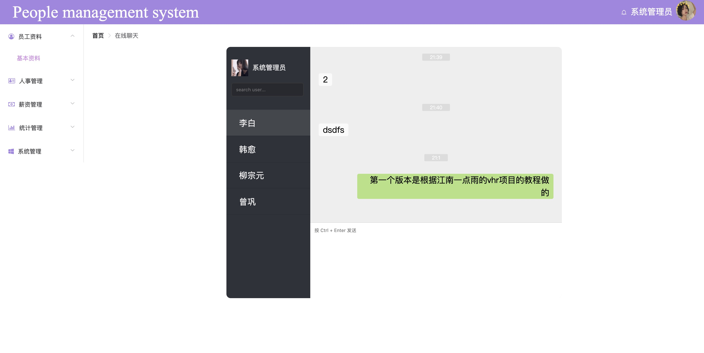
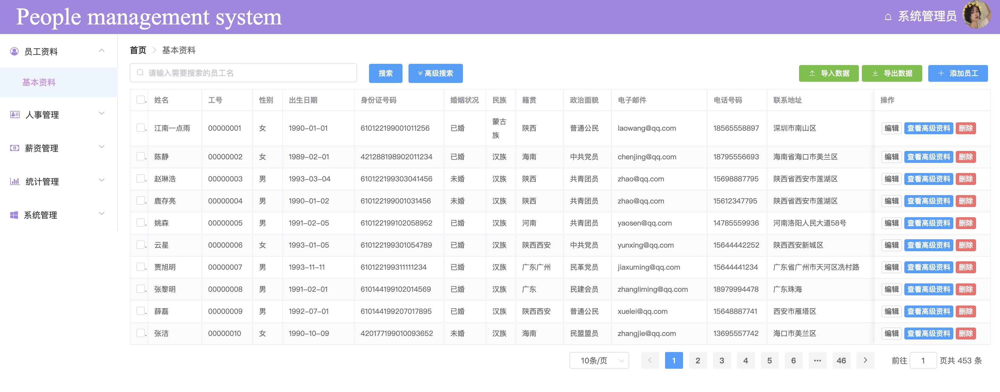
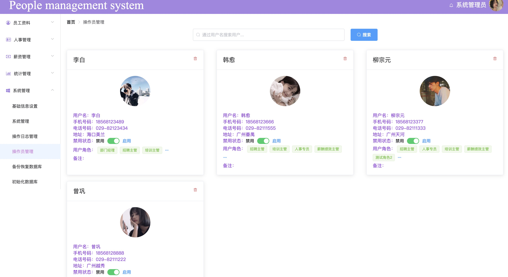

# vuehr

## Project setup
```
npm install
```

### Compiles and hot-reloads for development
```
npm run serve
```

### Compiles and minifies for production
```
npm run build
```

### Run your tests
```
npm run test
```

### Lints and fixes files
```
npm run lint
```

### Customize configuration
See [Configuration Reference](https://cli.vuejs.org/config/).


初次提交的版本是根据[江南一点雨](https://github.com/lenve/vhr)的vhr项目教程自己做的，调整了运行过程中出现的小bug，保证运行过程良好。
项目截图如下：




----------------------------------------------------------------------------------
